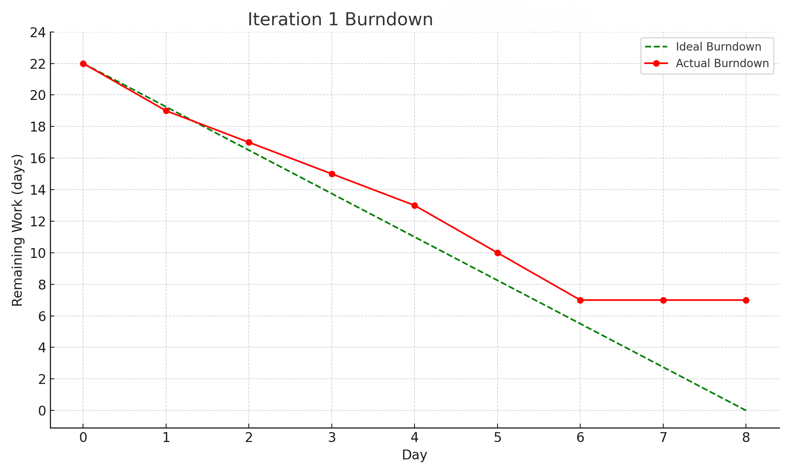

# Iteration 2:

* Assumed Velocity: no. of developers (4) * productive hours a day (5) * total days (8)* focus factor (~60%) / 4-6 for hour per story point
  (4 * 5 * ~8 * 0.6 /4) = ~24
* Number of developers: 4
* Total estimated amount of work: 10 days

User stories or tasks (see chapter 4): [user story or task title](./user_stories/user_story_01_title.md), priority XX, YY days 
1. 
2. 

In progress: * Task-2 (developer name or initials), date started
* 
* 

Completed: * Task-3 (developer name or initials), date completed
* 
* 

### Burn Down for iteration-1 (see chapter 4):
*  
Update this at least once per week, each iteration lasts around 3-4 weeks for now 
* 4 week(s), xx days of estimated amount of work 
* 2 week(s), xx days
* 1 week(s) left, xx days
* 0 week(s) left, xx days
* Actual Velocity: ?? 

### Retrospective

### What went well? 

1. When collaborating with groupmates in GitHub, the branches made it easier to work simultaneously, we could commit code to a branch and eventually merge it once we were ready 
2. When holding meeting from scrum, we were all punctual and communicated our goals as well as difficulties well to each other, this made troubleshooting a group effort and more efficient.

#### What problems did we face?

1. Some members had different versions of GitHub, desktop app, local version, or the web version, this made troubleshooting confusing as sometimes the commiting and pushing or merging got desync
2. Time constraints were evident when working on user stories due to other projects in our team members schedule, this resulted in us dropping some user stories we found less crucial for functionality
3. Even when branches were used there were still merging issues

#### Learning and action items

1. We spent alot of time solving the merging issue and updating ourselves on the code formatting and what we were actually doing. 
2. Spacing out user stories and their functionalities gave us ample time to work between our schedules and together.
